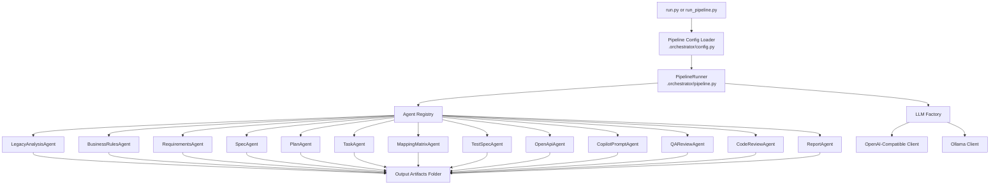

# Architecture, Purpose, and Tech Stack

## Purpose

This framework converts legacy mainframe inputs (COBOL and copybooks) into a structured, spec-driven modernization artifact set.

Goals:

- Preserve business logic during modernization
- Build clear traceability from legacy assets to modern deliverables
- Provide an AI-assisted workflow with deterministic fallback
- Produce implementation-ready outputs for developers, QA, and reviewers

## High-Level Architecture

## Core Components

### 1. Entry Layer

- run.py
  - User-friendly cross-platform launcher
  - Handles dependency install from requirements.txt
  - Builds and runs the pipeline command
- run_pipeline.py
  - Main CLI entrypoint for pipeline execution
  - Loads .env values (if present)
  - Resolves pipeline, input, and output paths
  - Wires AI settings into runtime environment variables

### 2. Orchestration Layer

- .agentic-sdlc/orchestrator/config.py
  - Loads YAML pipeline definitions
  - Validates required fields (pipeline name, non-empty agent list)
- .agentic-sdlc/orchestrator/pipeline.py
  - Contains PipelineRunner
  - Maintains the agent registry
  - Executes enabled agents sequentially

### 3. Agent Layer

- .agentic-sdlc/agents/base_agent.py
  - Shared agent behavior:
    - load prompt template
    - collect input files
    - include prior generated artifacts as context
    - generate content (LLM mode or deterministic mode)
    - validate non-empty output files
- .agentic-sdlc/agents/*.py
  - Concrete domain agents (analysis, requirements, spec, plan, tasks, mapping, tests, API, prompts, QA, code review, final report)

### 4. LLM Integration Layer

- .agentic-sdlc/llm/factory.py
  - Loads AGENTIC_AI_* configuration
  - Builds provider client (OpenAI-compatible or Ollama)
- .agentic-sdlc/llm/http_clients.py
  - OpenAiCompatibleClient: POST /v1/chat/completions
  - OllamaClient: POST /api/generate

## Runtime Flow

1. User runs run.py (recommended) or run_pipeline.py.
2. Pipeline YAML is loaded (mainframe_modernization).
3. PipelineRunner iterates through each configured agent.
4. Each agent reads legacy input and previous outputs.
5. Agent generates artifact content:
   - deterministic template mode, or
   - live AI mode (OpenAI-compatible / Ollama)
6. Artifacts are written to output directory.

## Tech Stack

### Language and Runtime

- Python 3.11+

### External Packages (from requirements.txt)

- PyYAML>=6.0
  - Used for loading pipeline YAML configuration
- pytest>=8.0
  - Used for test execution and validation

### Standard Library Modules Used Heavily

- argparse (CLI argument parsing)
- pathlib (cross-platform paths)
- dataclasses (typed config/result models)
- typing (type hints)
- os, sys (environment and runtime setup)
- urllib.request (HTTP calls to AI providers)
- json (AI request/response serialization)
- subprocess (runner command execution)

Note: OpenAI integration is implemented through an OpenAI-compatible HTTP client using urllib.request; the official openai SDK is not required.

## Output Artifacts Produced

- program-analysis.md
- business-rules.md
- requirements.md
- spec.md
- plan.md
- tasks.md
- mapping-matrix.md
- traceability-matrix.md
- test-spec.md
- openapi.yaml
- copilot-build-prompt.md
- qa-review-checklist.md
- code-review-checklist.md
- modernization-report.md

## Configuration Surface

Environment variables:

- AGENTIC_AI_ENABLED
- AGENTIC_AI_PROVIDER
- AGENTIC_AI_MODEL
- AGENTIC_AI_BASE_URL
- AGENTIC_AI_API_KEY
- AGENTIC_AI_TIMEOUT_SECONDS

CLI options:

- run.py --mode openai --openai-api-key <key>
- run_pipeline.py --use-ai --ai-provider openai --ai-api-key <key> ...
