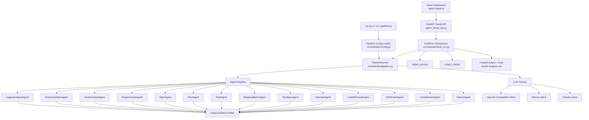

# Architecture, Purpose, and Tech Stack

## Purpose

This framework converts legacy mainframe inputs (COBOL and copybooks) into a spec-driven modernization artifact set with traceability and review outputs.

Goals:

- Preserve approved legacy behavior during modernization.
- Produce implementation-ready artifacts for engineering and QA.
- Support deterministic generation and optional AI-assisted generation.
- Support dual-model verification and merge for higher confidence.

## High-Level Architecture

## Core Components

### 1. Entry Layer

- run.py
  - Convenience launcher for template, dry-run, ollama, and openai modes.
  - Optional dependency installation from requirements.txt.
- run_pipeline.py
  - Main CLI entrypoint for pipeline execution.
  - Loads runtime env values.
  - Resolves pipeline/input/output paths.
  - Supports dual-model compare with Claude.

### 2. Orchestration Layer

- .agentic-sdlc/orchestrator/config.py
  - Loads and validates YAML pipeline definitions.
- .agentic-sdlc/orchestrator/pipeline.py
  - Executes enabled agents sequentially.
  - Emits run and agent lifecycle events.
- .agentic-sdlc/orchestrator/dual_run.py
  - Runs primary and Claude pipelines.
  - Supports parallel dual execution.
  - Supports non-AI demo-mode dual phases.
  - Compares artifacts and merges final output.
  - Produces dual-model-analysis.md.

### 3. Agent Layer

- .agentic-sdlc/agents/base_agent.py
  - Shared logic for template loading, context aggregation, generation, and output validation.
- .agentic-sdlc/agents/*.py
  - Domain agents for analysis, intent, requirements, spec, planning, tests, contract, reviews, and report generation.

### 4. LLM Integration Layer

- .agentic-sdlc/llm/factory.py
  - Loads AGENTIC_AI_* settings.
  - Enforces required API key validation for cloud providers.
- .agentic-sdlc/llm/http_clients.py
  - OpenAiCompatibleClient: POST /v1/chat/completions
  - OllamaClient: POST /api/generate
  - ClaudeClient: POST /v1/messages

### 5. Visual Operations Layer

- agent_visual_api.py (FastAPI)
  - Starts runs, tracks run state, stores event stream, serves artifact content.
  - Exposes elapsed_seconds timer data per run.
  - Accepts demo-mode, parallel-run, and token optimization controls.
  - Exposes endpoints for health, runs, run details, artifacts, and artifact content.
- agent-visual-ui (React + Vite)
  - Starts pipeline runs from UI.
  - Displays live run events and dual-model phase progression.
  - Displays elapsed run timer.
  - Supports Classic/Neon theme toggle.
  - Displays generated artifacts in-browser.

## Runtime Flow

Single-model flow:

1. User starts run with CLI or API.
2. PipelineRunner executes agents in configured order.
3. Event sink records run_started, agent_started, agent_completed, run_completed.
4. Artifacts are written to output.

Dual-model flow:

1. Primary run executes into output_primary.
2. Claude run executes into output_claude.
3. Merge stage reconciles artifacts into output.
4. dual-model-analysis.md summarizes differences and merge decisions.

Demo-mode dual flow:

1. Primary phase runs dry-run output generation.
2. Claude phase runs dry-run output generation.
3. Merge phase combines outputs with heuristic selection.
4. Full phase telemetry remains available for visualization.

## Tech Stack

### Language and Runtime

- Python 3.11+
- Node.js 18+ (visual dashboard)

### External Packages (requirements.txt)

- PyYAML>=6.0
- pytest>=8.0
- fastapi>=0.110
- uvicorn[standard]>=0.29

### Visual UI Stack

- React 18
- Vite 5

### Python Standard Library Used Heavily

- argparse
- pathlib
- dataclasses
- typing
- os, sys
- urllib.request
- json
- threading
- subprocess

## Output Artifacts Produced

- program-analysis.md
- business-rules.md
- intended-system.md
- requirements.md
- spec.md
- plan.md
- tasks.md
- mapping-matrix.md
- traceability-matrix.md
- test-spec.md
- openapi.yaml
- copilot-build-prompt.md
- qa-review-checklist.md
- code-review-checklist.md
- modernization-report.md
- dual-model-analysis.md (dual mode)

## Configuration Surface

Environment variables:

- AGENTIC_AI_ENABLED
- AGENTIC_AI_PROVIDER
- AGENTIC_AI_MODEL
- AGENTIC_AI_BASE_URL
- AGENTIC_AI_API_KEY
- AGENTIC_AI_TIMEOUT_SECONDS
- AGENTIC_CLAUDE_MODEL
- AGENTIC_CLAUDE_BASE_URL
- AGENTIC_CLAUDE_API_KEY

CLI examples:

- run_pipeline.py --dry-run
- run_pipeline.py --use-ai --ai-provider openai --ai-model gpt-4o-mini
- run_pipeline.py --use-ai --compare-with-claude --claude-model claude-haiku-4-5-20251001
- run_pipeline.py --demo-mode --parallel-dual-run
- run_pipeline.py --use-ai --compare-with-claude --parallel-dual-run --optimize-tokens
