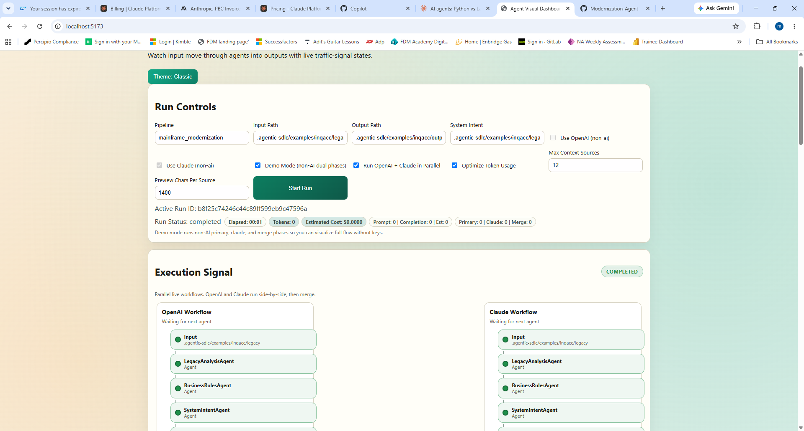
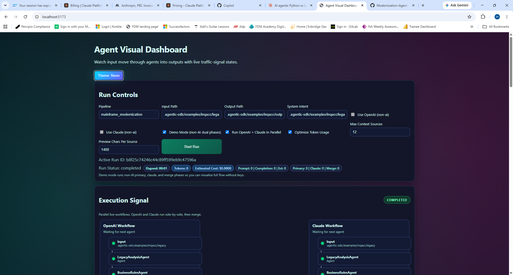
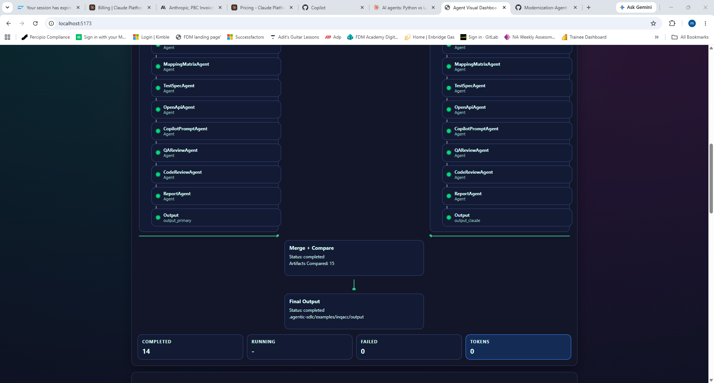
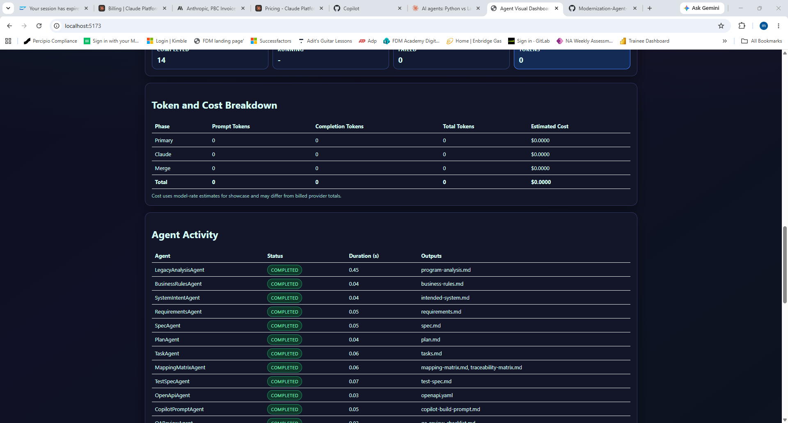
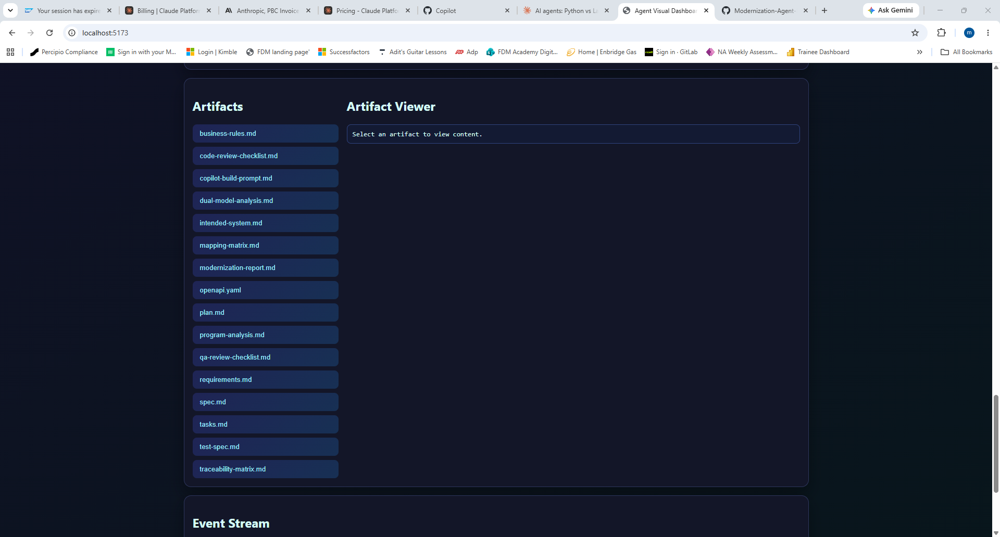

# Agentic SDLC Framework for Mainframe Modernization

This repository contains a local multi-agent framework that turns legacy assets into implementation-ready modernization artifacts with strong traceability.

## What It Generates

- program-analysis.md
- business-rules.md
- intended-system.md
- requirements.md
- spec.md
- plan.md
- tasks.md
- mapping-matrix.md
- traceability-matrix.md
- test-spec.md
- openapi.yaml
- copilot-build-prompt.md
- qa-review-checklist.md
- code-review-checklist.md
- modernization-report.md

In dual-model mode it also produces:

- dual-model-analysis.md

## Core Capabilities

- Sequential multi-agent artifact generation
- System intent capture before requirements and spec generation
- Optional AI providers: Ollama, OpenAI-compatible, Claude
- Dual-model comparison and merge (primary + Claude)
- Visual run orchestration API with live event stream
- Demo mode that simulates full primary/claude/merge flow without AI keys
- Parallel dual-model execution for faster compare runs
- Prompt context token optimization controls for faster, lower-cost generation
- Live elapsed timer in dashboard for run duration tracking
- Dashboard theme switcher (Classic and Neon)
- Deterministic dry-run mode

## New Execution Flow

Single-model run:

1. Pipeline runs all enabled agents in order.
2. Each agent emits start/completion events.
3. Artifacts are written to the output folder.

Dual-model run (compare mode):

1. Primary model run writes to `output_primary`.
2. Claude run writes to `output_claude`.
3. Merge stage reconciles artifacts into final `output`.
4. `dual-model-analysis.md` captures differences and merge rationale.

Demo dual-model run:

1. Primary phase runs in dry-run mode.
2. Claude phase runs in dry-run mode.
3. Merge phase selects and combines outputs without LLM merge.
4. Full phase/event flow is still emitted for UI visualization.

## Quick Start

Non-AI deterministic run:

```powershell
python run_pipeline.py --pipeline mainframe_modernization --input .agentic-sdlc/examples/inqacc/legacy --output .agentic-sdlc/examples/inqacc/output --dry-run
```

AI run with OpenAI-compatible provider:

```powershell
python run_pipeline.py --pipeline mainframe_modernization --input .agentic-sdlc/examples/inqacc/legacy --output .agentic-sdlc/examples/inqacc/output --use-ai --ai-provider openai --ai-model gpt-4o-mini --ai-base-url https://api.openai.com
```

## Easy Run (Dashboard)

Use one command to launch both backend and UI in separate PowerShell windows:

```powershell
powershell -ExecutionPolicy Bypass -File .\scripts\start-dashboard.ps1
```

Optional custom ports:

```powershell
powershell -ExecutionPolicy Bypass -File .\scripts\start-dashboard.ps1 -ApiPort 8010 -UiPort 5175
```

Then open the UI URL printed by the script.

## Environment Configuration (Safe for Git)

The runtime loads settings in this order:

1. Process environment variables
2. `.env.local` (local secrets, git-ignored)
3. `.env` (committed defaults)

Commit policy:

- Keep `AGENTIC_AI_API_KEY=` blank in `.env`
- Keep `AGENTIC_CLAUDE_API_KEY=` blank in `.env`
- Store real keys only in `.env.local`

Example `.env.local`:

```dotenv
AGENTIC_AI_API_KEY=<YOUR_OPENAI_KEY>
AGENTIC_CLAUDE_API_KEY=<YOUR_CLAUDE_KEY>
```

Optional system intent input:

```powershell
python run_pipeline.py --pipeline mainframe_modernization --input .agentic-sdlc/examples/inqacc/legacy --output .agentic-sdlc/examples/inqacc/output --system-intent .agentic-sdlc/examples/inqacc/legacy/system-intent.md --use-ai --ai-provider openai --ai-model gpt-4o-mini --ai-base-url https://api.openai.com
```

Manual pipeline command with explicit key override:

```powershell
python run_pipeline.py --pipeline mainframe_modernization --input .agentic-sdlc/examples/inqacc/legacy --output .agentic-sdlc/examples/inqacc/output --use-ai --ai-provider openai --ai-model gpt-4o-mini --ai-base-url https://api.openai.com --ai-api-key <YOUR_KEY>
```

## Dual-Model Verification

```powershell
python run_pipeline.py --pipeline mainframe_modernization --input .agentic-sdlc/examples/inqacc/legacy --output .agentic-sdlc/examples/inqacc/output --system-intent .agentic-sdlc/examples/inqacc/legacy/system-intent.md --use-ai --ai-provider openai --ai-model gpt-4o-mini --ai-base-url https://api.openai.com --ai-api-key <PRIMARY_KEY> --compare-with-claude --claude-model claude-haiku-4-5-20251001 --claude-api-key <CLAUDE_KEY>
```

Requirements:

- Primary AI key is required for OpenAI-compatible mode.
- Claude key is required when `--compare-with-claude` is enabled.
- Missing key validation fails fast with a clear error message.

Parallel control:

- `--parallel-dual-run` (default on) runs primary and Claude phases concurrently.
- `--no-parallel-dual-run` runs them sequentially.

Token optimization controls:

- `--optimize-tokens` (default on)
- `--token-max-sources <n>`
- `--token-preview-chars <n>`
- `--ai-max-output-tokens <n>`
- `--claude-max-output-tokens <n>`
- `--auto-tune-tokens`
- `--auto-tune-quality-threshold <0.0-1.0>`

Token cap behavior:

- Primary provider cap comes from `--ai-max-output-tokens` or `AGENTIC_AI_MAX_OUTPUT_TOKENS`.
- Dual-run Claude cap comes from `--claude-max-output-tokens`, then `AGENTIC_CLAUDE_MAX_OUTPUT_TOKENS`, then `AGENTIC_AI_MAX_OUTPUT_TOKENS`.
- If no cap is set, provider defaults are used (Claude defaults to 4096 in this framework).

Cost model (dashboard estimate):

- Estimated cost = `(prompt_tokens / 1000 * prompt_rate) + (completion_tokens / 1000 * completion_rate)`
- Completion tokens are usually the biggest controllable cost lever, so output caps are the fastest way to reduce spend.

Token optimization process:

1. Start with `--optimize-tokens` enabled and set `--token-max-sources 8 --token-preview-chars 1000`.
2. Set an output cap: `--ai-max-output-tokens 1600` and, if dual-run is enabled, `--claude-max-output-tokens 1200`.
3. Run once and capture token usage/cost from the dashboard or `/api/runs/<id>`.
4. If quality is acceptable, reduce one variable at a time in this order: output cap, preview chars, max sources.
5. If quality regresses, increase only the last changed setting and keep others low.
6. Use dual-model mode only for high-confidence checkpoints, not every iteration.
7. Re-baseline monthly or when models/prompts change.

Auto-tune mode (recommended for first-time calibration):

```powershell
python run_pipeline.py --pipeline mainframe_modernization --input .agentic-sdlc/examples/inqacc/legacy --output .agentic-sdlc/examples/inqacc/output --use-ai --auto-tune-tokens
```

How auto-tune works:

1. Runs multiple preset token configurations.
2. Scores each run for estimated quality (artifact structure, traceability IDs, completeness).
3. Estimates cost from prompt/completion token usage.
4. Applies quality threshold (default 0.92 of best quality), then selects lowest-cost candidate.
5. Copies selected artifacts into the main output folder.
6. Writes `token-optimization-report.md` with full comparison and recommended flags.

Demo mode command:

```powershell
python run_pipeline.py --pipeline mainframe_modernization --input .agentic-sdlc/examples/inqacc/legacy --output .agentic-sdlc/examples/inqacc/output --demo-mode --parallel-dual-run
```

Dual-model outputs:

- .agentic-sdlc/examples/inqacc/output_primary
- .agentic-sdlc/examples/inqacc/output_claude
- .agentic-sdlc/examples/inqacc/output
- .agentic-sdlc/examples/inqacc/output/dual-model-analysis.md

## Validate Claude Connectivity

```powershell
python test_claude_api.py
```

## Visual Layer (React)

Run API backend:

```powershell
python -m uvicorn agent_visual_api:app --reload --port 8000
```

Run React dashboard:

```powershell
cd agent-visual-ui
npm install
npm run dev
```

Then open `http://localhost:5173` to start runs, view agent execution events, and inspect generated outputs.

### UI Screenshots

Classic theme:



Neon theme:



Additional neon views:





UI behavior summary:

- `Use OpenAI = off`: runs in deterministic mode with no API keys.
- `Use OpenAI = on`: requires `AGENTIC_AI_API_KEY`.
- `Use Claude = on`: also requires `AGENTIC_CLAUDE_API_KEY`.
- `Demo Mode = on`: forces non-AI dual-phase run with merge for realistic live demo flow.
- `Run OpenAI + Claude in Parallel`: toggles concurrent dual execution.
- `Optimize Token Usage`: enables compact prompt context controls.
- Header shows elapsed run timer while execution is active.
- Dual mode shows primary and Claude workflows converging into `Merge + Compare`, then `Final Output`.
- Run controls show active model names from run metadata (for example OpenAI and Claude model IDs).
- Theme toggle supports Classic and Neon visual styles.

## Legacy Runner Note

`run.py` remains available as a convenience launcher for template, dry-run, ollama, and openai modes.

## Documentation

- Runbook: HOW_TO_RUN.md
- Framework docs: .agentic-sdlc/docs
- Agent catalog: AGENTS.md
